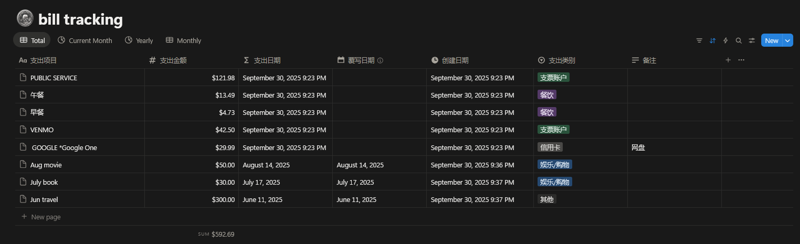
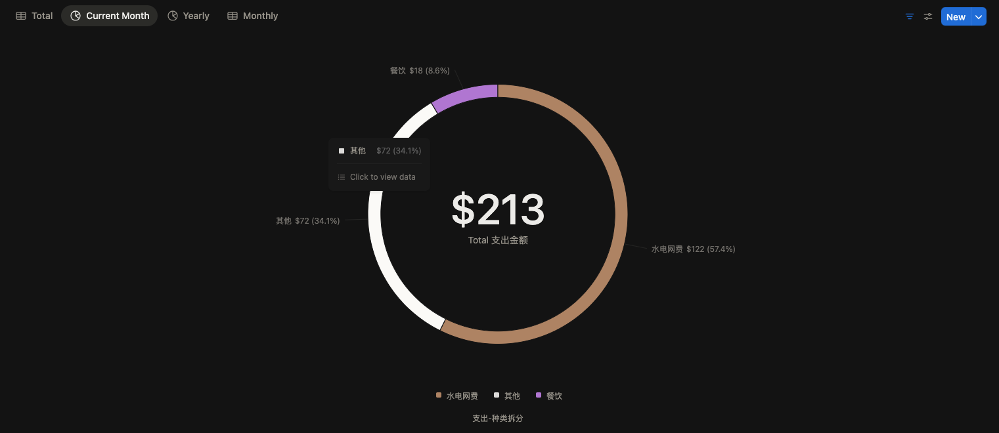
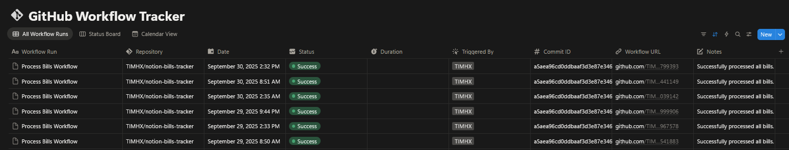
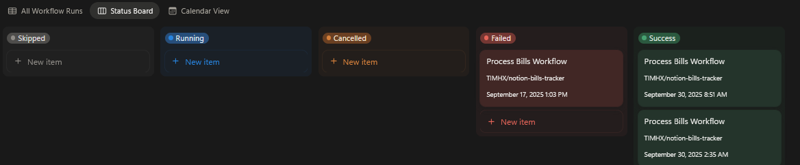
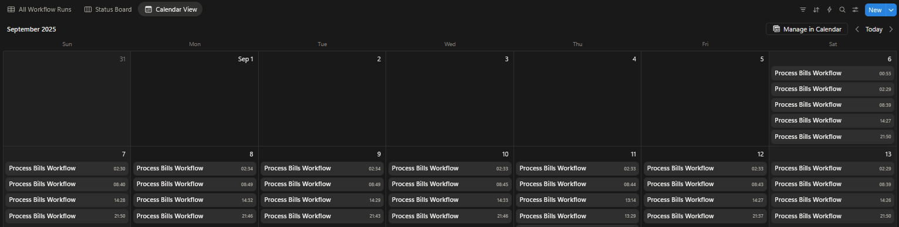

# Notion Bill Tracker

从 Gmail 自动提取账单信息并写入 Notion 数据库。使用 DSPy + 多 LLM provider fallback 做结构化提取。

## Public notion demo
[Bill tracker](https://www.notion.so/public-27f55a34994980c086e6fe771fecea91?source=copy_link) — 个人账单追踪 & workflow 运行记录。

## Features

- **Gmail Integration**: 根据 `config/gmail_config.yaml` 中配置的 `query` 和 `sender_filter` 拉取未读邮件。`sender_filter` 支持部分匹配、大小写不敏感（如 `"Chase"` 匹配 `"JPMorgan Chase"`）。
- **Double-Counting Prevention**: `exclude_merchants` 配置项可排除特定商户（如 Chase 账单中的 `CITI AUTOPAY` 会被跳过，避免 Citi 独立账单重复记账）。
- **Multi-Provider LLM Fallback**: 使用 DSPy 结构化提取，按顺序尝试 DeepSeek → Gemini → MiniMax。每个 provider 独立重试（exponential backoff），失败自动切换到下一个。设置 `DEEPSEEK_API_KEY` / `GEMINI_API_KEY` / `MINIMAX_API_KEY` 中至少一个即可。
- **Structured Extraction**: 基于 Pydantic 模型 + DSPy Signature 提取：
  - `merchant` — 商户名称
  - `amount` — 金额
  - `bill_category` — 账单类别（餐饮 / 娱乐购物 / 水电网费 / 房租 / 车租和保险 / 其他）
  - `date` — 交易日期（`YYYY-MM-DD`）
  - `expense_type` — 支出 vs. 收入（`支出` / `收入`，不确定时默认 `支出`）
- **Dynamic Bill Category Mapping**: `config/bill_categories.yaml` 中按商户关键词映射类别（如 `"PROG GARDEN ST"` → `"车租和保险"`），DSPy prompt 中动态注入。
- **Notion Database Management**: 提取结果写入 Notion database，含 `支出项目`、`支出金额`、`支出类别`、`支出 vs. 收入`、`覆写日期` 等属性。
- **Workflow Tracking**: 每次运行状态记录到独立 Notion database，含 commit ID、workflow URL、触发者等，方便监控。
- **Configurable Logging**: 敏感信息（邮件 subject/sender/body、提取出的账单详情）仅 `DEBUG` 级别输出。汇总统计（总数、成功/跳过/错误数）`INFO` 级别输出。默认 `WARNING` 不泄露交易数据。通过 `LOG_LEVEL` 环境变量控制。

## Output example
### Bill view


### Workflow view




## Project Structure

```
notion-bills-tracker/
├── .github/
│   └── workflows/
│       ├── process-bills.yml    # 定时 + 手动触发
│       └── get_secret.yaml      # 调试用：验证 secrets 是否正确注入
├── config/
│   ├── bill_categories.yaml     # 商户 → 类别映射
│   ├── gmail_config.yaml        # Gmail query、sender_filter、exclude_merchants
│   └── notion_config.yaml       # Notion database ID
├── src/
│   ├── __init__.py
│   ├── main.py                  # 主流程
│   ├── gmail_client.py          # Gmail API 封装
│   ├── bill_processor.py        # DSPy + 多 provider fallback 提取
│   ├── notion_client.py         # Notion API 封装
│   └── logger_utils.py          # 统一日志
├── .gitignore
├── pyproject.toml
├── uv.lock
└── README.md
```

## Setup and Installation

### 1. Clone the Repository

```bash
git clone https://github.com/TIMHX/notion-bills-tracker.git
cd notion-bills-tracker
```

### 2. Set up Python Environment with uv

```bash
uv venv
source .venv/bin/activate
uv sync
```

### 3. Configuration Files

#### `config/gmail_config.yaml`
```yaml
query: "is:unread label:账单 -in:inbox"
sender_filter: ["Chase", "citi"]
# 排除特定 merchant，避免 double counting
# 例：Chase 和 Citi 账单中同时出现 CITI AUTOPAY，排除后只记 Citi 自己发的
exclude_merchants: ["CITI AUTOPAY"]
```

#### `config/bill_categories.yaml`
商户关键词 → 类别映射，DSPy 提取时动态注入：
```yaml
PROG GARDEN ST: 车租和保险
TOYOTA: 车租和保险
PUBLIC SERVICE: 水电网费
OPTIMUM: 水电网费
EVERYDAY: 餐饮
PPK CAFÉ: 餐饮
CITI AUTOPAY: 娱乐/购物
COSTCO: 娱乐/购物
```

### 4. Google Cloud & Gmail API Setup

1.  [Google Cloud Console](https://console.cloud.google.com/) 创建项目，启用 **Gmail API**。
2.  OAuth consent screen → External → 添加 scope：
    - `https://www.googleapis.com/auth/gmail.readonly`
    - `https://www.googleapis.com/auth/gmail.modify`
3.  Credentials → Create OAuth client ID → Web application，Redirect URI 填 `https://developers.google.com/oauthplayground`。获得 **Client ID** 和 **Client Secret**。
4.  [OAuth 2.0 Playground](https://developers.google.com/oauthplayground) → 齿轮图标 → 勾选 "Use your own OAuth credentials" 填入 Client ID/Secret → 粘贴 scopes → Authorize → Exchange → 获得 **Refresh Token**。

### 5. LLM API Keys（至少设一个）

| Provider | 获取方式 | 环境变量 |
|---|---|---|
| DeepSeek（推荐，快 + 便宜） | [platform.deepseek.com](https://platform.deepseek.com/) | `DEEPSEEK_API_KEY` |
| Gemini（稳定，有免费额度） | [Google AI Studio](https://aistudio.google.com/app/apikey) | `GEMINI_API_KEY` |
| MiniMax（备用） | [minimaxi.com](https://www.minimaxi.com/) | `MINIMAX_API_KEY` |

### 6. Notion Integration

1.  [Notion Integrations](https://www.notion.so/my-integrations) → New integration → 获得 **Internal Integration Token**。
2.  创建账单 database，属性如下（中文名，区分大小写）：

    | 属性名 | 类型 |
    |---|---|
    | `支出项目` | Title |
    | `支出金额` | Number |
    | `支出类别` | Select（选项：餐饮 / 娱乐购物 / 水电网费 / 房租 / 车租和保险 / 其他） |
    | `支出 vs. 收入` | Select（选项：支出 / 收入） |
    | `覆写日期` | Date |

3.  创建 workflow tracking database（任意 schema，代码按属性名匹配）。
4.  分别将两个 database share 给 integration。
5.  从 URL 提取 Database ID（`https://www.notion.so/` 后、`?v=` 前的部分）。

### 7. Environment Variables

创建 `.env`（本地开发）：

```env
# Gmail OAuth（必填）
GMAIL_CLIENT_ID=your_client_id
GMAIL_CLIENT_SECRET=your_client_secret
GMAIL_REFRESH_TOKEN=your_refresh_token

# Notion（必填）
NOTION_API_KEY=your_notion_integration_token
NOTION_DATABASE_ID=your_bill_database_id
NOTION_WORKFLOW_DATABASE_ID=your_workflow_database_id

# LLM（至少设一个）
DEEPSEEK_API_KEY=sk-xxx
GEMINI_API_KEY=AIza...
MINIMAX_API_KEY=eyJ...

# 可选
LOG_LEVEL=WARNING  # WARNING | INFO | DEBUG（DEBUG 会输出全文，仅调试用）
```

## Running Locally

```bash
python src/main.py
```

使用 refresh token 认证 Gmail API，无需浏览器交互。

## GitHub Actions Setup

1.  Repository → Settings → Secrets and variables → Actions → 添加以下 secrets：

    | Secret | 说明 |
    |---|---|
    | `GMAIL_CLIENT_ID` | Google OAuth Client ID |
    | `GMAIL_CLIENT_SECRET` | Google OAuth Client Secret |
    | `GMAIL_REFRESH_TOKEN` | Gmail refresh token |
    | `NOTION_API_KEY` | Notion integration token |
    | `NOTION_DATABASE_ID` | 账单 database ID |
    | `NOTION_WORKFLOW_DATABASE_ID` | workflow tracking database ID |
    | `DEEPSEEK_API_KEY` | DeepSeek API key |
    | `GEMINI_API_KEY` | Gemini API key |
    | `MINIMAX_API_KEY` | MiniMax API key |
    | `LOG_LEVEL` | （可选）默认 `WARNING`。设 `DEBUG` 仅调试用 |

2.  工作流每 **12 小时**自动运行，也可在 Actions tab 手动 `workflow_dispatch` 触发。

3.  `get_secret.yaml`：调试用 workflow，验证 secrets 是否正确注入（仅你作为 repo collaborator 可触发，public repo 的 workflow_dispatch 外部不可见）。

## License

MIT License.
